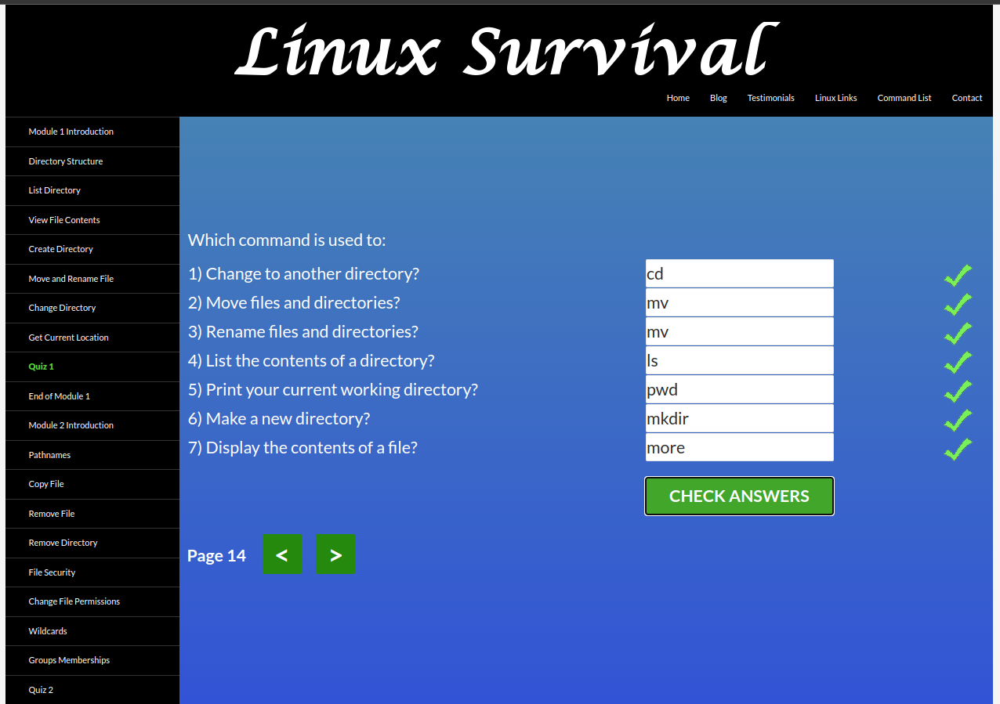
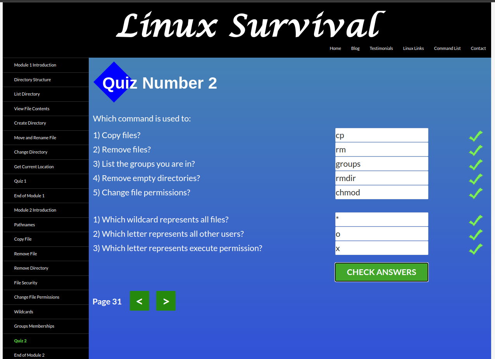
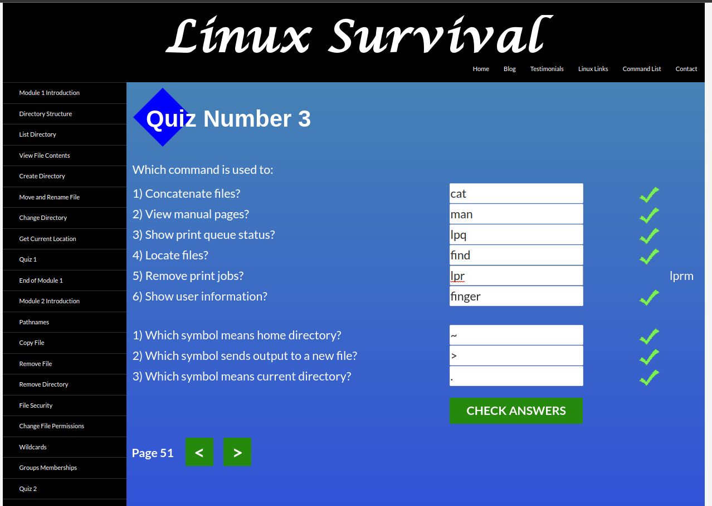
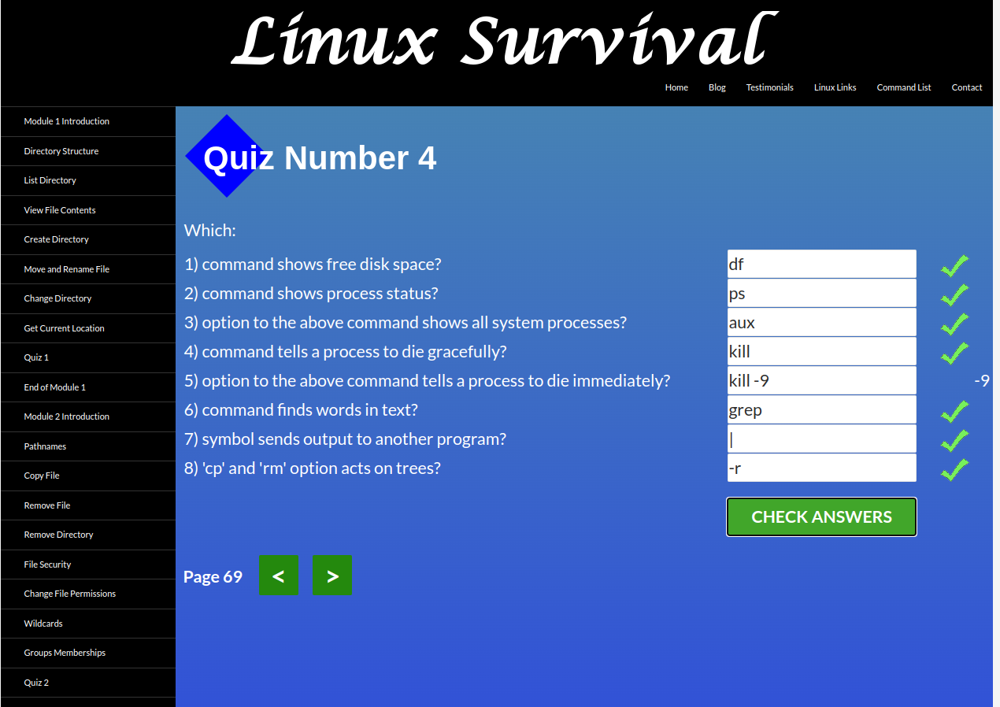

# kottans-backend

Hello!

My name is Mykola. I want to get a glimpse on the way backend works.

## Unix Shell
### Linux Survival
#### Module 1
Everything was familiar except that I haven't used "more" before

#### Module 2
Didn't hear about rmdir. Also I've learned more about chmod

#### Module 3
Printer commands and finger were new for me

#### Module 4
Every command was familiar but I learned that df - "disk free", ps - "process status"

### Learning the Shell
I've just repeated what I've known before.
One handy thing I've found out is "focus follows mouse" - it is very convenient
